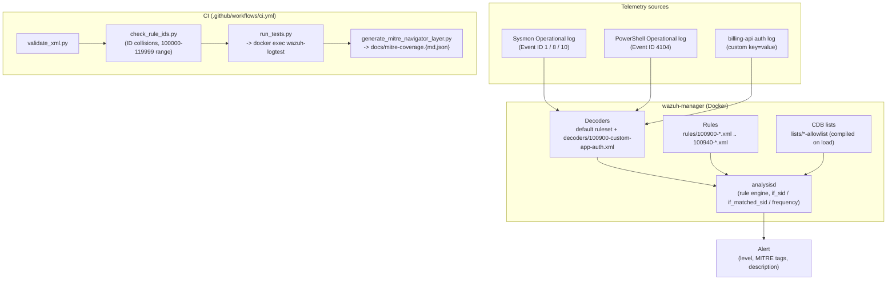

# Architecture

## Why manager-only, not the full indexer/dashboard stack

`docker-compose.yml` here runs exactly one container: `wazuh-manager`.
Rule/decoder/correlation logic lives entirely in `analysisd`, which ships
inside that one image - the indexer (OpenSearch) and dashboard are
consumers of the alerts `analysisd` produces, not part of evaluating
whether a rule fires. Standing up the 4+ container indexer cluster just
to run `wazuh-logtest` in CI would be slower, flakier (cluster health,
TLS cert generation - see the official
[wazuh-docker](https://github.com/wazuh/wazuh-docker) `generate-indexer-certs`
step), and irrelevant to what this repo tests. For local exploration with
a real dashboard, layer the official `single-node/` compose from that
repo on top and point its manager at this repo's `rules/`/`decoders/`/`lists/`
volumes instead of its own defaults.

## Why `wazuh-logtest` via `docker exec`, not the REST API

Wazuh also exposes rule testing over the server API
(`PUT /logtest`, JSON in/out, documented at
[documentation.wazuh.com](https://documentation.wazuh.com/current/user-manual/reference/tools/wazuh-logtest.html)).
That's the better choice for a long-lived shared environment where you
don't want shell access. For a throwaway CI container it adds JWT
auth-token bootstrapping and a second thing that can fail for reasons
unrelated to rule correctness; `docker exec -i wazuh-manager
/var/ossec/bin/wazuh-logtest` needs nothing but the container running,
and - documented in `tests/run_tests.py` - one CLI invocation keeps one
session/token for as many lines as are piped into it, which is exactly
the state `100940`'s correlation rules need to prove themselves in a
test.

## Versioning

`wazuh/wazuh-manager:4.14.7` is pinned explicitly everywhere it's
referenced (`docker-compose.yml`). Never `latest` - a CI pipeline that
silently starts testing against a different Wazuh version than what's
running in production is worse than no CI. Bump the pin deliberately,
in its own commit, after re-running the full suite.
