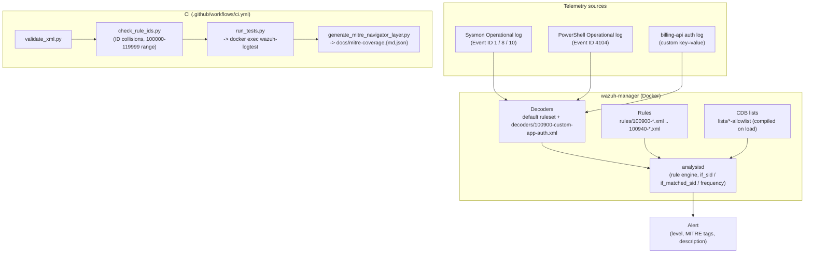

# Architecture

## Why manager-only, not the full indexer/dashboard stack

`docker-compose.yml` here runs exactly one container: `wazuh-manager`.
Rule/decoder/correlation logic lives entirely in `analysisd`, which ships
inside that one image - the indexer (OpenSearch) and dashboard are
consumers of the alerts `analysisd` produces, not part of evaluating
whether a rule fires. Standing up the 4+ container indexer cluster just
to run `wazuh-logtest` in CI would be slower, flakier (cluster health,
TLS cert generation - see the official
[wazuh-docker](https://github.com/wazuh/wazuh-docker) `generate-indexer-certs`
step), and irrelevant to what this repo tests. For local exploration with
a real dashboard, layer the official `single-node/` compose from that
repo on top and point its manager at this repo's `rules/`/`decoders/`/`lists/`
volumes instead of its own defaults.

## Why `wazuh-logtest` via `docker exec`, not the REST API

Wazuh also exposes rule testing over the server API
(`PUT /logtest`, JSON in/out, documented at
[documentation.wazuh.com](https://documentation.wazuh.com/current/user-manual/reference/tools/wazuh-logtest.html)).
That's the better choice for a long-lived shared environment where you
don't want shell access. For a throwaway CI container it adds JWT
auth-token bootstrapping and a second thing that can fail for reasons
unrelated to rule correctness; `docker exec -i wazuh-manager
/var/ossec/bin/wazuh-logtest` needs nothing but the container running,
and - documented in `tests/run_tests.py` - one CLI invocation keeps one
session/token for as many lines as are piped into it, which is exactly
the state `100940`'s correlation rules need to prove themselves in a
test.

## Health check

The container healthcheck tests for the `wazuh-logtest` unix socket
(`/var/ossec/queue/sockets/logtest`) specifically, not `wazuh-control
status`. The latter was tried first and never reported healthy in CI:
it also waits on the API and on the indexer-connector component inside
`analysisd`, both of which retry indefinitely against an OpenSearch
indexer this manager-only compose file deliberately doesn't run - the
container logs showed `analysisd` (and `wazuh-logtest`) fully up and
usable while `wazuh-control status` kept the healthcheck red. Checking
for the exact socket this repo actually depends on is both more precise
and faster to go green.

## Versioning

`wazuh/wazuh-manager` is pinned by **digest**, not the `4.14.7` tag,
everywhere it's referenced (`docker-compose.yml`) - a mutable tag can be
repointed at a different image without the repo changing at all; a
digest can't. Never `latest` either way - a CI pipeline that silently
starts testing against a different Wazuh version than what's running in
production is worse than no CI. Bump the pin deliberately, in its own
commit, after re-running the full suite; find the current digest for a
given tag with `docker buildx imagetools inspect wazuh/wazuh-manager:<tag>`.

GitHub Actions in `.github/workflows/ci.yml` are pinned by commit SHA
(`actions/checkout@<sha> # v4.4.0`) for the same reason - a floating
`@v4` tag is one compromised or force-pushed release away from running
different code in this pipeline than what was reviewed.

## Security posture of this compose file

This is a **local/CI testing lab**, not a production deployment - but it
was reviewed as if it might get exposed anyway, since "it's just a demo"
is exactly the kind of thing that ends up reachable from the internet by
accident. Concretely:

- **No ports are published at all, by default.** `docker-compose.yml`
  has no `ports:` block - `tests/run_tests.py` and `scripts/bootstrap_manager.sh`
  only ever `docker exec` into the container, and never touch the
  network, so there is nothing to publish for this repo's own purposes.
  Two earlier, weaker versions of this were reviewed and rejected in
  order: first, no binding restriction at all (every port open on every
  interface); then `127.0.0.1`-only binding - better, but a loopback
  bind still leaves the manager, and its unchanged default API/enrollment
  credentials, reachable to every other process and user on the same
  machine, which is a real question on a shared host. Not publishing
  anything sidesteps it entirely instead of trusting a bind address to
  answer it. Want to connect a real agent or hit the API/dashboard
  locally anyway? Copy `docker-compose.override.yml.example` to
  `docker-compose.override.yml` (already git-ignored) - it publishes the
  same three ports, loopback-only, with the credential-hardening steps
  spelled out first.
- **1514, if you do publish it, should be TCP, not UDP.** Wazuh's default
  secure agent<->manager channel is TCP (see
  [`remote` in the ossec.conf reference](https://documentation.wazuh.com/current/user-manual/reference/ossec-conf/remote.html)).
  An earlier version of this file published `1514/udp` - a real agent
  following this project's own README would never have connected.
  `docker-compose.override.yml.example` publishes it correctly.
- **CDB lists are staged read-only, not bind-mounted read-write.**
  Wazuh needs to write a compiled `.cdb` next to each list's source, so
  `/var/ossec/etc/lists` has to be writable at runtime - but a
  read-write bind mount would mean a compromised manager process could
  edit the *source* allow-list too, and have that edit land directly in
  this repo's working tree on the host. `docker-compose.yml` mounts the
  lists read-only at a staging path instead
  (`./lists:/wazuh-lab/lists-src:ro`), and `scripts/bootstrap_manager.sh`
  copies them into the container's own writable filesystem - any runtime
  write, malicious or not, stays inside the container and is gone on the
  next `docker compose up`.

What's *not* fixed, and won't be by tightening this compose file further:
`lists/lsass-access-allowlist` is path-based (see its own header comment
and `docs/detections/100910-lsass-credential-access.md` "Future work") -
that's a detection-logic tradeoff, not a deployment misconfiguration, and
narrowing network exposure doesn't touch it.
